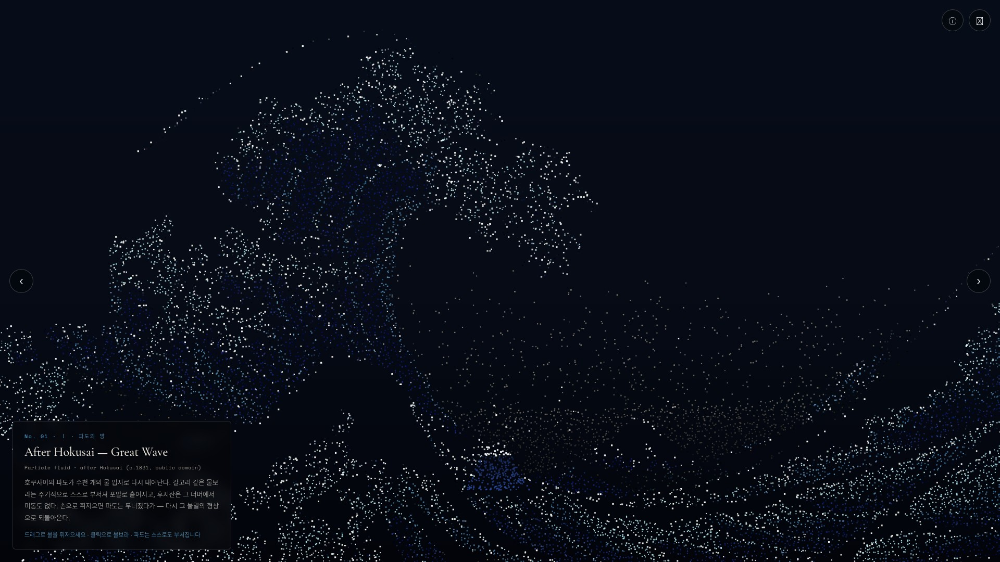
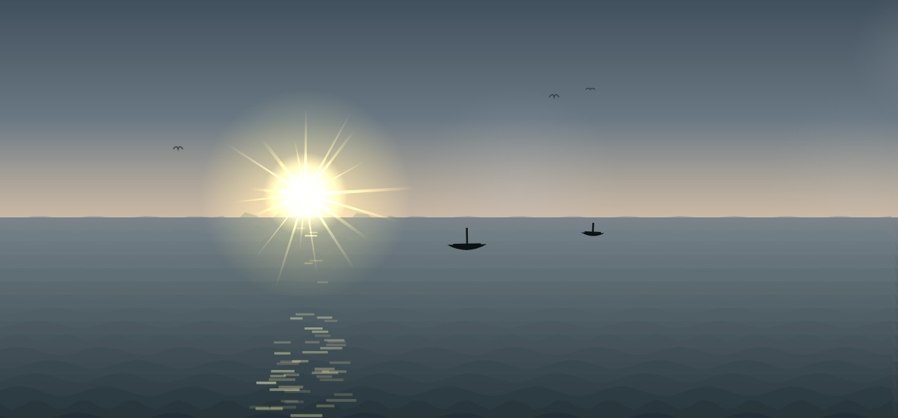
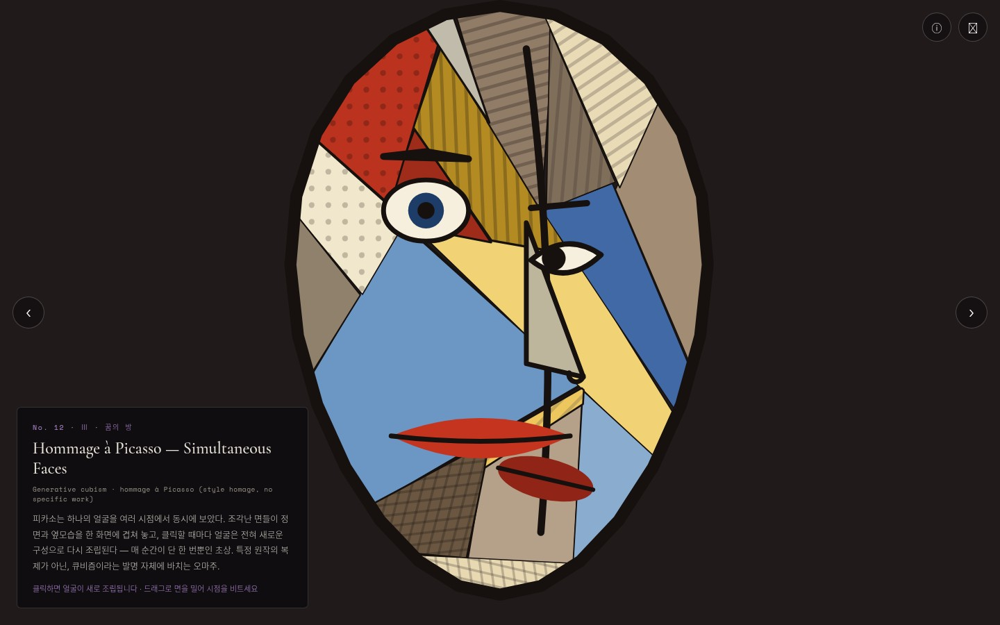
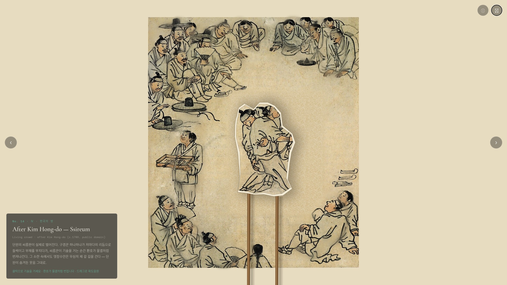

# Masterpieces Reborn

[](https://reborn.zerojin.art/)
[]()
[](https://claude.com/claude-code)
<a href="#english"></a>
<a href="#korean"></a>

An interactive generative-art exhibition that reimagines 16 world masterpieces in code, built end-to-end with Claude (Fable 5) | 세계 걸작 명화 16점을 코드로 재해석한 인터랙티브 제너러티브 아트 전시 — Claude(Fable 5)와 함께 처음부터 끝까지 제작

## Preview | 미리보기

**Visit the live exhibition | 라이브 전시 관람하기: <https://reborn.zerojin.art/>**

Every screen below is rendered live and responds to your cursor. | 아래 모든 화면은 실시간으로 그려지며 커서에 반응합니다.

|  |  |
|:---:|:---:|
| **Wing I · After Hokusai — Great Wave** (가나가와 해변의 높은 파도)<br>Thousands of water particles gather into the wave and crash on their own<br>수천 개의 물 입자가 파도로 응집하고 스스로 부서집니다 | **Wing II · After Monet — Impression, Sunrise** (인상, 해돋이)<br>Click and the sun bursts with radiant beams<br>클릭하면 태양이 눈부신 광선을 사방으로 뻗습니다 |
|  |  |
| **Wing III · Hommage à Picasso — Simultaneous Faces** (동시의 얼굴)<br>Every click — or a wave of your hand on camera — reassembles an entirely new cubist portrait<br>클릭하거나 카메라 앞에서 손을 흔들 때마다 전혀 새로운 큐비즘 초상으로 재조립됩니다 | **Wing IV · After Kim Hong-do — Ssireum** (씨름)<br>The wrestlers take the stage as paper puppets on sticks<br>씨름꾼이 막대에 붙은 종이 인형이 되어 무대에 오릅니다 |

---

<a id="english"></a>

# English

## Overview

Masterpieces Reborn is a zero-build web exhibition in which 16 public-domain masterpieces — from Hokusai's Great Wave to An Gyeon's Dream Journey — are reinterpreted as real-time interactive generative art. Every frame is rendered live on a Canvas 2D surface: particles gather into the Great Wave and crash under your cursor, ink bleeds into hanji paper on Jeong Seon's Inwangjesaekdo, and Kim Hong-do's wrestlers become paper puppets on sticks. Visit the live exhibition at https://reborn.zerojin.art/.

The entire site — curation, specification, 16 artwork modules, tests, quality gates, and deployment — was produced in conversation with Claude (Fable 5) using a subagent-driven development process. The full story is in [How It Was Made](#how-it-was-made).

## Features

- **16 interactive works across 4 wings** — particle fluids, chiaroscuro lantern reveals, ink-wash diffusion, living crowds, moonlight narratives, scroll-journey parallax, paper-puppet theatre, and a generative cubist portrait that reassembles on every click
- **Zero-build architecture** — vanilla ES modules and Canvas 2D only; no frameworks, no bundler; deploying is a single `aws s3 sync`
- **Hand-gesture works** — pressing the 📷 button in a work loads MediaPipe Hand Landmarker on demand (pinned CDN version) and, for works that opt in, the shell synthesizes the hand into the pointer contract: in Great Wave an open palm stirs the sea and a fist-to-open flick throws spray, and in Birth of Venus the same open palm becomes the west wind that scatters the sea-foam and rose petals. Nothing external is downloaded until the button is pressed; the mouse keeps working as a fallback. Camera video is processed locally in the browser and is never uploaded or stored
- **Shared particle engine** — a reusable gather/scatter/restore engine (`js/particle-engine.js`) drives the Wave Hall: pixels sampled from the original painting become spring-driven particles that scatter under the pointer and return to the immortal image
- **Data-driven shell** — `js/data.js` is the single source of truth; the atrium, cards, viewer, and navigation render automatically from 16 metadata entries
- **Piece module contract** — every artwork is one ES module exporting `{init, tick, resize, dispose}`; the shell owns the rAF loop and pointer state, so pieces stay pure and leak-free

## How It Was Made

This project doubles as a case study in building non-trivial creative software with an AI agent. The user provided direction and taste; Claude provided curation proposals, code, verification, and honest reporting.

### 1. Starting point

The brief was a reference site (an existing generative-art exhibition and its published making-of prompts) plus one instruction: "build a world-masterpieces exhibition with Fable 5, and make several works in the style of After Hokusai — Great Wave." Claude analyzed the reference site's architecture (zero-build ES modules, one module per piece) and its collaboration style (big picture first, iterate, raise the bar).

### 2. Pipeline

Every phase ran through explicit gates rather than one long improvisation:

```text
brainstorm (requirements Q&A, curation approval)
  -> design spec (docs/superpowers/specs/, committed)
  -> implementation plan (per-task code or behavior contracts)
  -> subagent-driven development
       - one fresh implementer agent per task
       - one independent reviewer agent per task (spec + code quality)
       - progress ledger for crash-safe resumption
  -> integration smoke (browser sweep of every work, transition endurance, mobile)
  -> content quality gate (independent content review, must score >= 85/100)
  -> deploy (S3 + CloudFront via tools/deploy.sh) and live smoke test
```

For the first 12 works, 11 piece modules were drafted by parallel agents in one orchestrated workflow, then each was verified against the module contract (no event listeners, no timers, dt-accumulated time only) before entering the plan.

### 3. "Find the original yourself"

For later works the user set a distinctive process rule: instead of being handed reference material, the implementing agent had to search the web for the original painting itself, download it, and build while comparing its render side-by-side with the original — recording at least two comparison rounds (what differed, what was fixed) in its report. The fingertip coordinates in Creation of Adam, the crowd ellipses in Ssireum, and the parallax band boundaries in Dream Journey were all pixel-measured against originals this way.

### 4. Curation and copyright decisions

- All 16 originals were verified public domain before inclusion; Korean modern painters who died after 1962 (Park Soo-keun, Kim Whanki) were excluded because their works are still protected in Korea
- Piece 12 went through three identities: Hiroshige's Sudden Shower, then Lee Jung-seob's Bull (Korea-PD but ambiguous in the US, so rendered as a bundled-asset-free paper-puppet reinterpretation), and finally a Picasso homage — since Picasso is protected until 2043, it copies no specific work and instead turns cubism's simultaneous viewpoints into a generative portrait that reassembles on every click
- Wing IV (Korean Masters) bundles real scans of four Joseon paintings (1447-1793), which are unambiguously public domain worldwide

### 5. Feedback loops, including failures

The user reviewed screenshots after each change; several pieces went through multiple honest iterations:

- **Bull**: the first version was rejected twice ("no power, wrong head direction, too small") and was rebuilt as a full-screen close-up matching the original composition before being replaced by the Picasso homage
- **Mona Lisa's smile**: an image-reveal solution made the smile visible but was rejected as "too photographic"; a hard-edged high-density face patch was rejected as "alien to the rest" and for making the opening gather awkwardly. The current version has no face patch at all: dot density follows the painting's light and contours, so the lit face and chest are denser and the dark dress sparser, with no halo around the head. Dots snap to feature pixels (lip line, eyelids) so the smile survives sampling, and the gather is choreographed so body and background condense first and the face rises last
- **Great Wave full-screen**: the first cover-fit attempt destroyed the iconic silhouette (a uniform starfield) and was reverted; the redo differentiates particle density (empty sky, dense foam and sea) so the hooked wave reads clearly while traveling waves keep the whole screen undulating
- **Ssireum puppets**: refined across three rounds — crop tiles, then silhouette cutouts with sticks and drop shadows, then background inpainting and stick shadows until no trace of the original wrestlers remained behind the lifted puppet

### 6. Verification culture

- Node tests (data integrity, particle-engine math, module interface conformance, camera/hand-gesture logic, piece choreography) run on every task
- Every piece was driven in a real browser (Playwright) — screenshots, console-error checks, interaction simulation, dispose/re-enter cycles
- Independent per-task reviews plus a final whole-branch review before each merge; every merge passed an independent content gate (85 or higher) with findings fixed before deploy

## Prerequisites

- A modern browser (Chrome, Edge, Firefox, Safari)
- Python 3 (or any static file server) for local viewing
- Node.js 20+ (tests only)
- AWS CLI with credentials (deployment only)

## Installation

```bash
# Clone the repository
git clone https://github.com/comeddy/masterpieces-reborn.git
cd masterpieces-reborn

# No dependencies to install - the site is zero-build
```

## Usage

```bash
# Serve locally
python3 -m http.server 8090

# Open http://127.0.0.1:8090 in a browser
```

- Click a card to enter a work; every work responds to drag and click (each viewer panel shows the interaction hints)
- Press Escape to return to the atrium, and the arrow keys to move between works
- The sound toggle (top right of the atrium) enables audio for works that support it
- In Great Wave (No. 01), press 📷 to control the sea by hand: an open palm dragged through the water swirls it; closing a fist and opening it again throws spray
- In Birth of Venus (No. 02), press 📷 and your open hand becomes the west wind: sweep it to blow the sea-foam off the goddess, hold it still to part the foam with a soft breath, close a fist and open it again for a gust, and a fast sweep leaves rose petals in its wake. Wind and gusts also work with the mouse (drag and click)
- In Mona Lisa (No. 04), press 📷 and sweep an open palm across the portrait to stir the sfumato haze; close a fist and open it again and the whole portrait scatters into smoke, the face returning last. The mouse keeps working as a fallback (drag and click)
- In Tower of Babel (No. 10), press 📷 and raise one hand to build, or hold up both hands for a moment to collapse the tower
- In The Tree of Life (No. 11), press 📷 and hold up a hand: new golden branches sprout toward wherever your hand lingers, and sweeping it sideways stirs the wind through the whole tree. The mouse keeps working as a fallback
- In Girl with a Pearl Earring (No. 03), press 📷 and your hand becomes the candle: sweep it to blow the light-dust away, and pinch thumb and index fingertips together to make the flame flicker in a wave of light. The mouse keeps working as a fallback
- In Simultaneous Faces (No. 12), press 📷 and wave your hand from side to side: the cubist portrait scatters and reassembles into an entirely new face. Move your hand slowly to push the facets and twist the viewpoints. The mouse keeps working as a fallback

Deploy your own copy (creates an S3 bucket and CloudFront distribution on first run):

```bash
./tools/deploy.sh
```

## Project Structure

```text
masterpieces-reborn/
  index.html               # Exhibition shell markup (atrium + viewer)
  css/style.css            # Dark gallery styling, per-wing accents
  js/
    main.js                # Shell logic: cards, viewer, rAF loop, pointer contract
    data.js                # Single source of truth: 4 wings, 16 works
    particle-engine.js     # Shared gather/scatter/restore particle engine
    pieces/01-*.js ... 16-*.js   # One ES module per artwork
  assets/targets/          # Public-domain source images (local bundle)
  test/                    # Node tests (data, engine math, integrity, camera/hand-gesture, choreography)
  tools/                   # fetch-targets.sh, deploy.sh
  docs/superpowers/        # Design specs and implementation plans
```

## Testing

```bash
node --test test/
# Node tests: data integrity, particle-engine math, module interface conformance, camera/hand-gesture logic, piece choreography
```

## Contributing

```text
1. Fork the repository
2. Create your branch (git checkout -b feat/amazing-feature)
3. Commit changes (git commit -m 'feat: add amazing feature')
4. Push to the branch (git push origin feat/amazing-feature)
5. Open a Pull Request
```

## License

- The code in this repository has no license assigned yet; all rights reserved until one is chosen
- All 16 source artworks are in the public domain; works whose status is jurisdiction-dependent (Lee Jung-seob) or protected (Picasso) are represented only as bundled-asset-free reinterpretations or style homages, never as reproductions

## Contact

- Maintainer: [comeddy](https://github.com/comeddy)
- Issues: https://github.com/comeddy/masterpieces-reborn/issues

---

<a id="korean"></a>

# 한국어

## 개요

Masterpieces Reborn은 호쿠사이의 파도에서 안견의 몽유도원도까지, 퍼블릭 도메인 걸작 16점을 실시간 인터랙티브 제너러티브 아트로 재해석한 제로-빌드 웹 전시입니다. 모든 화면은 Canvas 2D 위에서 매 프레임 실시간으로 그려집니다. 입자들이 파도로 응집했다가 커서에 부서지고, 인왕제색도의 화선지에는 먹이 번지며, 김홍도의 씨름꾼은 막대에 붙은 종이 인형이 되어 무대에 오릅니다. 라이브 전시는 https://reborn.zerojin.art/ 에서 관람합니다.

큐레이션, 설계 스펙, 16개 작품 모듈, 테스트, 품질 게이트, 배포까지 사이트 전체를 Claude(Fable 5)와의 대화로 제작했습니다. 전체 과정은 [제작 과정](#제작-과정)에 정리되어 있습니다.

## 주요 기능

- **4개 전시관, 16점의 인터랙티브 작품** — 입자 유체, 등불 키아로스쿠로, 수묵 번짐, 살아있는 군중, 달빛 내러티브, 두루마리 패럴랙스, 종이 인형극, 클릭마다 재조립되는 제너러티브 큐비즘 초상
- **제로-빌드 아키텍처** — 바닐라 ES 모듈과 Canvas 2D만 사용합니다. 프레임워크·번들러가 없어 배포는 `aws s3 sync` 한 번입니다
- **손짓 인터랙션 작품** — 작품 안 📷 버튼을 누른 시점에만 MediaPipe Hand Landmarker(CDN, 버전 고정)를 불러오고, 합성을 켠 작품에서는 셸이 손을 포인터 규약으로 합성합니다. 가나가와 파도에서는 펼친 손이 바다를 휘젓고 주먹을 쥐었다 펼치면 물보라가 튀며, 비너스의 탄생에서는 같은 펼친 손이 서풍이 되어 바다 거품과 장미 꽃잎을 흩날립니다. 버튼을 누르기 전에는 외부 다운로드가 없고 마우스는 폴백으로 계속 동작합니다. 카메라 영상은 브라우저 안에서만 처리되며 서버로 전송되거나 저장되지 않습니다
- **공용 입자 엔진** — 재사용 가능한 응집·흩어짐·복원 엔진(`js/particle-engine.js`)이 파도의 방을 구동합니다. 원작에서 샘플링한 픽셀이 스프링 입자가 되어 손길에 흩어졌다가 불멸의 형상으로 되돌아옵니다
- **데이터 주도 셸** — `js/data.js`가 단일 진실 소스입니다. 16개 메타데이터 항목만으로 아트리움, 카드, 뷰어, 내비게이션이 자동으로 렌더됩니다
- **작품 모듈 계약** — 모든 작품은 `{init, tick, resize, dispose}`를 내보내는 하나의 ES 모듈입니다. rAF 루프와 포인터 상태는 셸이 소유하므로 작품 모듈은 순수하고 누수가 없습니다

## 제작 과정

이 프로젝트는 AI 에이전트와 함께 비자명한 창작 소프트웨어를 만드는 사례 연구이기도 합니다. 사용자는 방향과 취향을 제시했고, Claude는 큐레이션 제안·코드·검증·정직한 보고를 담당했습니다.

### 1. 출발점

브리프는 참고 사이트(기존 제너러티브 아트 전시와 공개된 making-of 프롬프트)와 한 가지 지시였습니다: "Fable 5로 세계 걸작 전시를 만들고, 몇 작품은 After Hokusai — Great Wave 스타일로." Claude는 참고 사이트의 아키텍처(제로-빌드 ES 모듈, 작품당 1모듈)와 협업 방식(큰 그림 먼저, 반복 개선, 기준 상향)을 분석해 출발점으로 삼았습니다.

### 2. 파이프라인

모든 단계는 즉흥이 아니라 명시적 게이트를 통과했습니다:

```text
브레인스토밍 (요구사항 문답, 큐레이션 승인)
  -> 설계 스펙 (docs/superpowers/specs/, 커밋)
  -> 구현 계획 (태스크별 완전 코드 또는 행동 계약)
  -> 서브에이전트 구동 개발
       - 태스크마다 새 구현 에이전트 1개
       - 태스크마다 독립 리뷰 에이전트 1개 (스펙 + 코드 품질)
       - 중단에도 안전한 진행 원장 기록
  -> 통합 스모크 (전 작품 브라우저 검증, 전환 내구성, 모바일)
  -> 콘텐츠 품질 게이트 (독립 콘텐츠 리뷰, 85/100점 이상 필수)
  -> 배포 (tools/deploy.sh 로 S3 + CloudFront) 및 라이브 스모크
```

최초 12작품 중 11개 모듈은 하나의 오케스트레이션 워크플로에서 병렬 에이전트들이 초안을 만들었고, 각 초안은 모듈 계약(이벤트 리스너 금지, 타이머 금지, dt 누적 시간만 사용) 검증을 통과한 뒤 계획서에 수록되었습니다.

### 3. "원작을 직접 구해서 비교하며 만들어"

후반 작품들에는 사용자가 특별한 프로세스 규칙을 정했습니다. 자료를 건네받는 대신, 구현 에이전트가 웹에서 원작 이미지를 직접 검색·수집하고 자기 렌더와 원작을 나란히 놓고 비교하며 제작해야 하며, 비교 라운드 2회 이상(무엇이 달랐고 무엇을 고쳤는지)을 보고서에 기록해야 합니다. 아담의 창조의 손끝 좌표, 씨름의 인물 타원 좌표, 몽유도원도의 패럴랙스 층 경계가 모두 이 방식으로 원작 대비 픽셀 실측되었습니다.

### 4. 큐레이션과 저작권 의사결정

- 16점 전부 수록 전에 퍼블릭 도메인 여부를 검증했습니다. 1962년 이후 작고한 한국 근대 화가(박수근, 김환기)는 한국에서 아직 보호 중이라 제외했습니다
- 12번 작품은 세 번 바뀌었습니다: 히로시게의 소나기 → 이중섭의 황소(한국 PD이나 미국 지위가 애매해 원본 이미지를 번들하지 않는 종이 인형극 재해석으로 제작) → 최종적으로 피카소 오마주. 피카소는 2043년까지 보호되므로 특정 작품을 복제하지 않고, 큐비즘의 동시 시점 원리를 클릭마다 재조립되는 제너러티브 초상으로 번역했습니다
- Ⅳ관(한국의 방)은 전 세계적으로 명백한 퍼블릭 도메인인 조선 회화 4점(1447–1793)의 실제 스캔을 번들합니다

### 5. 피드백 반복 — 실패 포함

사용자는 변경마다 스크린샷을 검수했고, 여러 작품이 정직한 반복을 거쳤습니다:

- **황소**: 초판이 두 차례 반려되었습니다("힘찬 기운이 없다, 소머리 방향이 틀렸다, 너무 작다"). 원작 구도와 같은 화면 가득 클로즈업으로 재구성된 뒤, 최종적으로 피카소 오마주로 교체되었습니다
- **모나리자의 미소**: 이미지 리빌 방식은 미소를 보이게 했지만 "너무 사실적"이라 반려되었고, 경계가 뚜렷한 얼굴 고밀도 패치는 "주변과 이질적"이며 시작 응집이 어색하다는 피드백을 받았습니다. 현재판은 얼굴 패치를 두지 않고 점 밀도가 원작의 빛과 윤곽을 따르게 합니다. 빛이 닿는 얼굴·가슴은 촘촘하고 어두운 드레스는 성겨서 머리 주변에 밀도 고리가 생기지 않습니다. 점을 특징 픽셀(입술선·눈꺼풀)에 스냅해 미소가 샘플링에서 살아남게 하고, 몸·배경이 먼저 응결하고 얼굴이 마지막에 떠오르도록 응집을 안무합니다
- **파도 전체화면**: 첫 cover-fit 시도는 상징적 실루엣을 파괴해(균일한 별밭) revert되었습니다. 재작업은 입자 밀도를 차별화(하늘은 비우고 포말·바다는 조밀)해 갈고리 파도가 또렷이 읽히면서 진행파가 화면 전체를 일렁이게 합니다
- **씨름 인형**: 세 라운드에 걸쳐 다듬었습니다 — 크롭 타일, 실루엣 오리기+막대+드롭섀도, 그리고 배경 인페인트와 막대 그림자까지. 들린 인형 뒤에 원작 씨름꾼의 흔적이 전혀 남지 않을 때까지

### 6. 검증 문화

- Node 테스트(데이터 무결성, 입자 엔진 수학, 모듈 인터페이스 준수, 카메라·손 제스처 로직, 작품 안무)를 모든 태스크에서 실행합니다
- 모든 작품을 실제 브라우저(Playwright)로 구동했습니다 — 스크린샷, 콘솔 에러 확인, 인터랙션 시뮬레이션, dispose·재진입 사이클
- 태스크별 독립 리뷰에 더해 머지 전 whole-branch 최종 리뷰를 거쳤고, 모든 머지는 독립 콘텐츠 게이트(85점 이상)를 통과했고 지적 사항을 수정한 뒤 배포했습니다

## 사전 요구 사항

- 최신 브라우저 (Chrome, Edge, Firefox, Safari)
- Python 3 (또는 임의의 정적 파일 서버) — 로컬 관람용
- Node.js 20+ — 테스트 전용
- 자격 증명이 설정된 AWS CLI — 배포 전용

## 설치 방법

```bash
# 저장소를 복제합니다
git clone https://github.com/comeddy/masterpieces-reborn.git
cd masterpieces-reborn

# 설치할 의존성이 없습니다 - 제로-빌드 사이트입니다
```

## 사용법

```bash
# 로컬에서 서빙합니다
python3 -m http.server 8090

# 브라우저에서 http://127.0.0.1:8090 을 엽니다
```

- 카드를 클릭해 작품에 입장합니다. 모든 작품이 드래그와 클릭에 반응합니다(뷰어 패널에 인터랙션 힌트가 표시됩니다)
- Escape로 아트리움에 돌아가고, 화살표 키로 작품을 이동합니다
- 아트리움 우상단 사운드 토글로 사운드 지원 작품의 소리를 켭니다
- 01번 가나가와 파도에서 📷를 누르면 손으로 바다를 다룹니다. 펼친 손을 움직이면 소용돌이, 주먹을 쥐었다 펼치면 물보라
- 02번 비너스의 탄생에서 📷를 누르면 펼친 손이 서풍이 됩니다. 손을 휘저으면 여신을 이루는 바다 거품이 흩날리고, 가만히 두면 손 아래 거품이 숨결에 살짝 갈라지며, 주먹을 쥐었다 펼치면 돌풍, 빠르게 지나가면 그 자리에 장미 꽃잎이 날립니다. 바람과 돌풍은 마우스로도 가능합니다(드래그·클릭)
- 04번 모나리자에서 📷를 누르고 펼친 손을 초상 위로 움직이면 스푸마토 안개가 휘저어지고, 주먹을 쥐었다 펼치면 초상 전체가 연무로 흩어진 뒤 얼굴이 마지막에 돌아옵니다. 마우스로도 드래그·클릭으로 그대로 가능합니다
- 10번 바벨탑에서 📷를 누르고 한 손을 들면 탑이 쌓이고, 두 손을 잠시 들고 있으면 무너집니다
- 11번 생명의 나무에서 📷를 누르고 손을 들면 손이 머무는 자리로 금빛 가지가 돋아 자라고, 좌우로 휘두르면 나무 전체에 바람이 입니다. 마우스로도 그대로 가능합니다
- 03번 진주 귀걸이를 한 소녀에서 📷를 누르면 손이 촛불이 됩니다. 손을 휙 저으면 빛 먼지가 흩날리고, 엄지와 검지 끝을 맞대면 촛불이 깜빡이며 빛의 파동이 퍼집니다. 마우스로도 그대로 가능합니다
- 12번 동시의 얼굴에서 📷를 누르고 손을 좌우로 크게 흔들면 큐비즘 초상이 흩어졌다 전혀 새로운 얼굴로 재조립됩니다. 손을 천천히 움직이면 면들이 밀리며 시점이 비틀립니다. 마우스로도 그대로 가능합니다

직접 배포하려면(최초 실행 시 S3 버킷과 CloudFront 배포를 생성합니다):

```bash
./tools/deploy.sh
```

## 프로젝트 구조

```text
masterpieces-reborn/
  index.html               # 전시 셸 마크업 (아트리움 + 뷰어)
  css/style.css            # 다크 갤러리 스타일, 관별 액센트
  js/
    main.js                # 셸 로직: 카드, 뷰어, rAF 루프, 포인터 계약
    data.js                # 단일 진실 소스: 4관, 16작품
    particle-engine.js     # 공용 응집·흩어짐·복원 입자 엔진
    pieces/01-*.js ... 16-*.js   # 작품당 ES 모듈 1개
  assets/targets/          # 퍼블릭 도메인 원작 이미지 (로컬 번들)
  test/                    # Node 테스트 (데이터, 엔진 수학, 무결성, 카메라·손 제스처, 안무)
  tools/                   # fetch-targets.sh, deploy.sh
  docs/superpowers/        # 설계 스펙과 구현 계획
```

## 테스트

```bash
node --test test/
# Node 테스트: 데이터 구조, 입자 엔진 수학, 모듈 무결성, 카메라·손 제스처 로직
```

## 기여 방법

```text
1. 저장소를 Fork 합니다
2. 브랜치를 생성합니다 (git checkout -b feat/amazing-feature)
3. 변경 사항을 커밋합니다 (git commit -m 'feat: add amazing feature')
4. 브랜치에 Push 합니다 (git push origin feat/amazing-feature)
5. Pull Request를 엽니다
```

## 라이선스

- 이 저장소의 코드에는 아직 라이선스가 지정되지 않았습니다. 라이선스 선택 전까지 모든 권리를 보유합니다
- 16점의 원작은 모두 퍼블릭 도메인입니다. 지역에 따라 지위가 다르거나(이중섭) 보호 중인(피카소) 작가는 원본 이미지를 번들하지 않는 재해석 또는 스타일 오마주로만 다루며, 복제하지 않습니다

## 연락처

- 메인테이너: [comeddy](https://github.com/comeddy)
- 이슈: https://github.com/comeddy/masterpieces-reborn/issues
